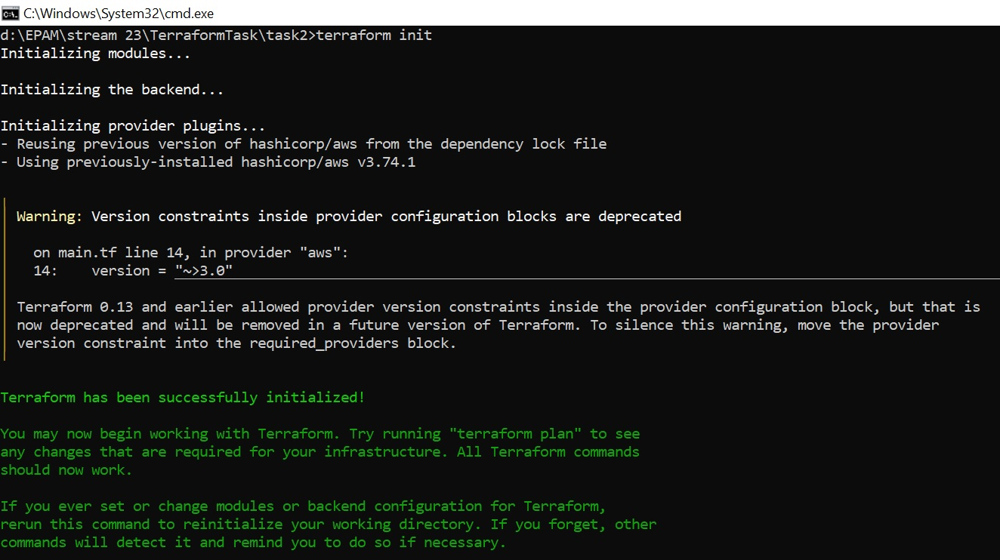
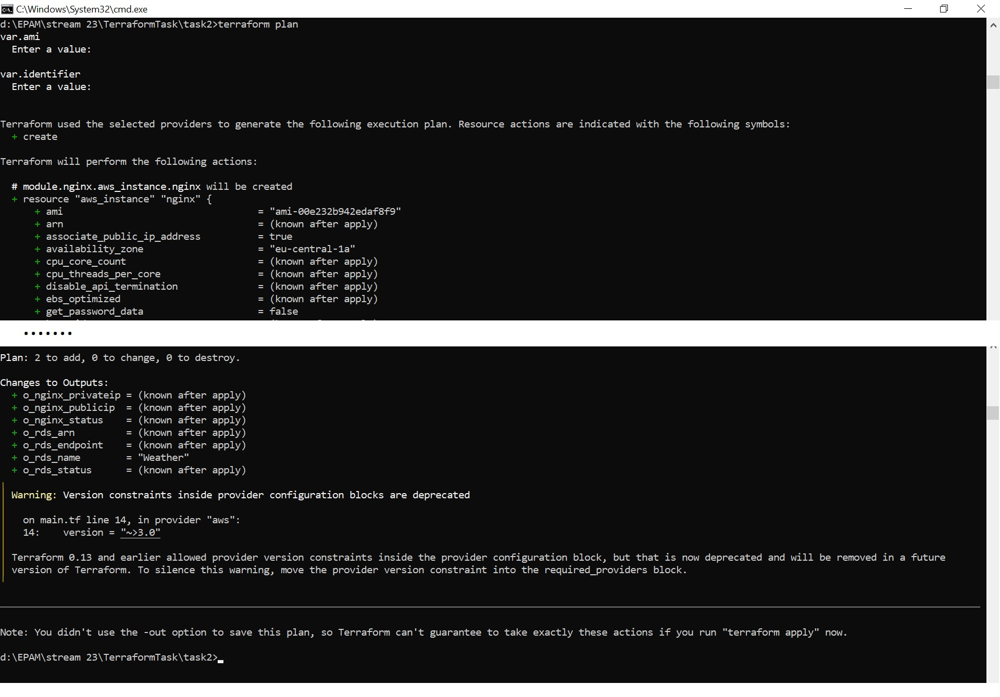
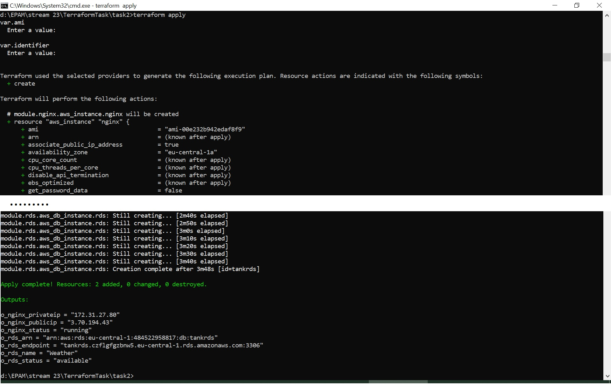
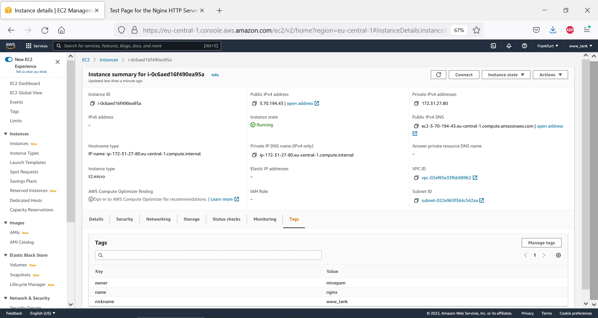
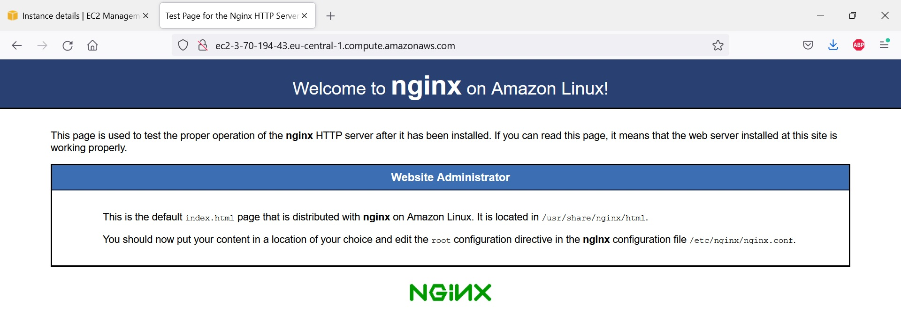
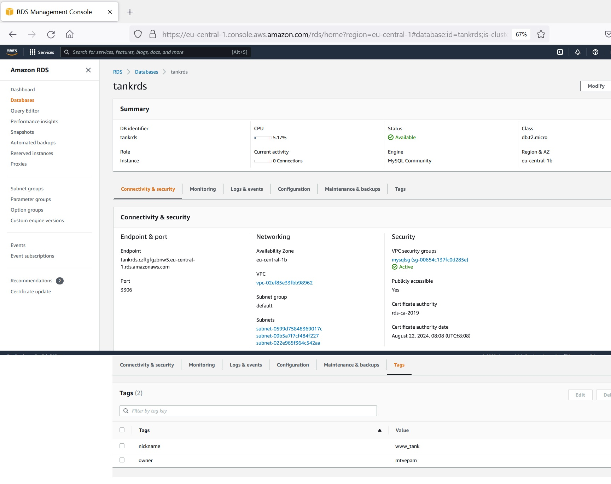
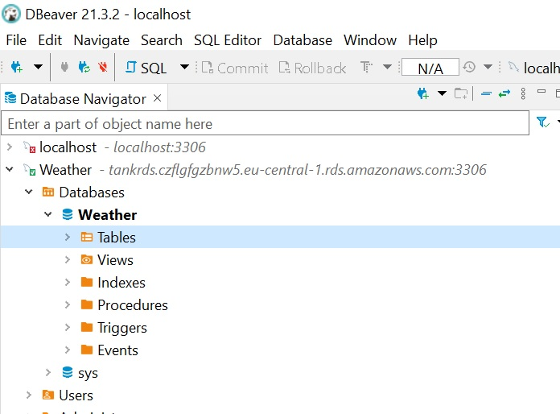
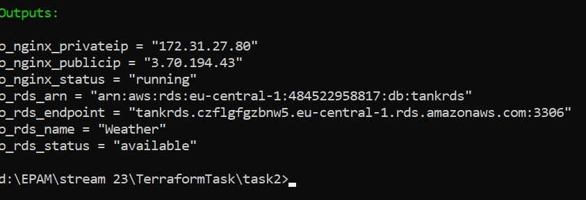

## Добрый день, Егор! 
### Задание 2 выполнено. 

Выделены два модуля для rds и ec2(nginx) с наборами variables и outputs. В корневом main.tf есть вызовы обоих модулей и outputs из них. 
Файл userdata.sh  содержит UserData для сервера nginx, а terraform.tfvars(занесен в .getignore) - пароли на БД и прочую чувствительную информацию.

### скриншоты выполнения манифестов

### скриншоты AWS c nginx

### скриншоты AWS c RDS

### outputs
 
С Уважением, Татьяна

